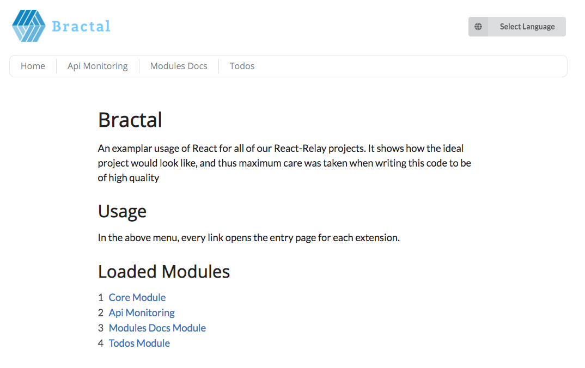

# Bractal

Bractal is a platform that enables you to get your React Apps, off-the-ground so quickly with a high quality initial infrastructure and UI components. It offers a wide range of easily customizable main components used in most web apps. Plus an easy way to extend and add additional components/modules of your own.

# Why Bractal

It differs from libraries like Bootsrap and SemanticUI, that Bractal not only provide UI components, but a way to extend and re-use components. Plus it's built from the ground up, on React, embracing concepts like styled-components. 

AND, if your app, is beyond a simple handful pages, then Bractal would be very handy to modularize your system.

# Getting started

## Pre-requisites

This guide assumes that you've at least some basic knowlede about the following topics :

   1. [React](https://reactjs.org/docs/getting-started.html)
   2. [GraphQL](https://www.howtographql.com)
   3. [Prisma](https://www.prisma.io/docs/quickstart/)
   4. [Relay](https://facebook.github.io/relay/docs/en/introduction-to-relay.html)

## Install

```bash
git clone https://github.com/BadrIT/bractal.git

cd bractal

npm install
npm start

npm run refetch-schema
npm run compile-relay
```

By now you should be able to see the welcome screen (Welcome !):



## Your first module

### Premise

We want to create a CRUD(create, update, delete) module for posts. Where the user can create a post, update a post or delete a post.

### Backend

To start, let's create a GraphQL using a Prisma hosted service. 

   1. Start a basic prisma demo service, by following the guide [Here](https://www.prisma.io/docs/quickstart/).
   2. Change the file 'datamodel.graphql' contents, to be exactly like [(this file)](docs/assets/getting_started/sample.datamodel.graphql)
   3. Deploy to prisma
   ```bash
    prisma deploy
   ```
   4. Now you should be able to explore your updated schema, and the following query should succeed (It would return empty results but that's fine for now) :
   ```graphql
    query {
      posts {
        id
        title
        description
      }
    }
   ```


# Roadmap

## Release 0 

- [x] Initialize the main file structure 
- [x] Write and document the initial style guide lines
- [x] Create initial set of simple UI componenets
- [x] Create plop generator for creating new modules
- [x] Create plop generator for creating new Relay CRUD views

## Release 1

- [ ] Remove dependency on GraphQL Backend (Unless requested explicitly)
- [ ] Document how to GetStarted using the plop generators
- [ ] Initialize the documentation using gitBooks Or StoryBooks
- [ ] Finalizing the theming approach
- [ ] Investigate using FusionJS for managing the pluggable architecture (Security, SSR, Theming...etc)
- [ ] Polish the initial set of components according to the finalized theming approach (Labels, Headers, Textbox, Layouts (Linear & Card),         Checkbox, Modal, Cropped Label, Tooltips)
- [ ] Create advanced components (Accordion, Menus, Advanced Select (Country, Phone, Date, Color...etc))
- [ ] Account Management Module (Polish and generalize, Create simple graphql backend service)
- [ ] Integrate Account Management with Auth0
  
## Release 2

- [ ] Document the modular architecture of Bractal
- [ ] API Monitoring (Build a backend for the tool, Build a simple UI, host a sample/freemium version)
- [ ] Module's API readiness validator
- [ ] eCommerce Module (Simple UI based on Spree, with GraphQL proxy)
 
# Contribution 

Create an issue on github, and let's discuss what you have in mind, then submit a pull request, after reading thoroughly the [Code Guidelines](StyleGuidelines.md)

# Why the name 'Bractal' ?

It stands for (BADR Fractal). Fractal is a known phenomenon in nature, which refer to expanding symmetry. It's a lovely mathematical/natural concept : https://en.wikipedia.org/wiki/Fractal).