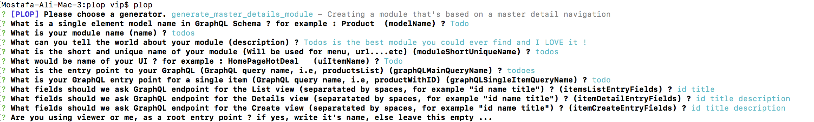
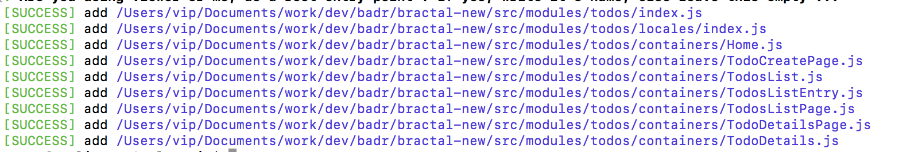

# Bractal

Bractal is a platform that enables you to get your React Apps, off-the-ground so quickly with a high quality initial infrastructure and UI components. It offers a wide range of easily customizable main components used in most web apps. Plus an easy way to extend and add additional components/modules of your own.

# Why Bractal

It differs from libraries like Bootsrap and SemanticUI, that Bractal not only provide UI components, but a way to extend and re-use components. Plus it's built from the ground up, on React.

AND, if your app, is beyond a simple handful pages, then Bractal would be very handy to modularize your system.

# Getting started

## Pre-requisites

This guide assumes that you've at least some basic knowledge about the following technologies :

   1. [React](https://reactjs.org/docs/getting-started.html)
   2. [GraphQL](https://www.howtographql.com)
   3. [Prisma](https://www.prisma.io/docs/quickstart/)
   4. [Relay](https://facebook.github.io/relay/docs/en/introduction-to-relay.html)

## Install

```bash
git clone https://github.com/BadrIT/bractal.git

cd bractal

npm install
npm install -g sass
npm start
```

By now you should be able to see the welcome screen (Welcome !):


## Creating your first module

### Premise

We want to create a CRUD(create, update, delete) module for a Todos List. Where the user can list his Todos, create a Todo, update a Todo or delete a Todo.

### Backend

To start, let's create a GraphQL using a Prisma hosted service. 

   1. Start a basic prisma demo service, by following the guide [Here](https://www.prisma.io/docs/quickstart/).
   2. Change the file 'datamodel.graphql' contents, to be exactly like [(this file)](docs/assets/getting_started/sample.datamodel.graphql)
   3. Deploy to prisma
   ```bash
    prisma deploy
   ```
   4. Now you should be able to explore your updated schema on prisma's playground (You should see it's URL on the terminal after executing the previous command), and the following query should succeed (It would return empty results but that's fine for now) :
   ```graphql
    query {
      todoes {
        id
        title
        description
      }
    }
   ```
   5. Voila` !!! , Hello GraphQL World !

### Frontend Setup

Now that we have fully functional GraphQL backend, let's move on to setup our Bractal Frontend to deal with it.

   1. We'll assume that you cloned this repo, and we'll refer to it's root from now on, by ```{AppRoot}```
   2. Now goto ```{AppRoot}/package.json```, and find all instances of ```__ENDPOINT__```.
   3. Replace them all with the URL, you obtained from the Backend step above. For example, the one I got was something like (https://eu1.prisma.sh/myname/servicename/dev)
   4. Now goto the terminal and run the following command
   ```bash
   cd {AppRoot}
   npm run refetch-schema
   npm run compile-relay
   ```
   5. if the above commands succeeded, and you got no errors, then at least now, we can start talking with our newly created prisma backend
   6. Note: if you have the app already running, you will need to restart it ```npm start``` because we have changed some environment variables after replacing ```__ENDPOINT__```

### Creating Frontend Views

Now let's add some exciting stuff. We'll create a bunch of views, with just few lines.

   1. Install plop ```npm install -g react-generator-templates plop```. Plop is a cool template generation tool [More details](https://github.com/bernabe9/react-generator).
   2. Now got to bractal's plop file and start creating your module. 
  ```bash
    cd {AppRoot}/plop
    plop generate_master_details_module
  ```
  3. You would be prompted with a number of questions, give it exactly the following answers : (You should experiment with different variations later, as appropriate) :
  
  4. If the everything went fine, you should see something like :
  
  5. Now you should see the newly created module in the path ```{AppRoot}/src/modules/todos```
  6. Now add the newly created modules to module configurations. To do so, change the contents of ```{AppRoot}/src/modulesConfig.js```. To be the same as [(This file)](docs/assets/getting_started/sample.moduleConfig.js)
  7. Rerun compile-relay to get the new Relay files :
  ```
  cd {AppRoot}
  npm run compile-relay
  ```
  7. Now you can run the app to see your new module 
  ```
  cd {AppRoot}
  npm start
  ```
  8. You should now see 'Todos' as a new entry in the top menu of the App.
  9. Open the Todos page, and create some entries, by clicking 'Create Todo'.
  10. To see the details of a certain Todo open a certain Todo by clicking it's details link.
  9. Voila` !!! , Hello Bractal World !

### Add/Delete Todo entries

// TODO

## Component documentation

Documentation is on : [Styleguidist] https://badrit.github.io/bractal/

to build a local version of the documentation, run :

```
npx styleguidist server
```

to add a documentation of a new component, add it's link to the appropriate location here :
{AppRoot}/styleguide.config.js

Then add a '*.md' file beside it. (Check {AppRoot}/src/modules/coreUI/components/basic/Labels.md, for an example)

# Roadmap

## Release 0 

- [x] Initialize the main file structure 
- [x] Write and document the initial style guide lines
- [x] Create initial set of simple UI componenets
- [x] Create plop generator for creating new modules
- [x] Create plop generator for creating new Relay CRUD views

## Release 1

- [x] Document how to GetStarted using the plop generators
- [x] Initialize the documentation using styleguidits
- [x] Finalizing the theming approach
- [ ] Investigate using FusionJS for managing the pluggable architecture (Security, SSR, Theming...etc)
- [ ] Polish the initial set of components according to the finalized theming approach (Labels, Headers, Textbox, Layouts (Linear & Card),         Checkbox, Modal, Cropped Label, Tooltips)
- [ ] Create advanced components (Accordion, Menus, Advanced Select (Country, Phone, Date, Color...etc))
- [ ] Account Management Module (Polish and generalize, Create simple graphql backend service)
- [ ] Integrate Account Management with Auth0
- [ ] Remove dependency on GraphQL Backend (Unless requested explicitly)
  
## Release 2

- [ ] Document the modular architecture of Bractal
- [ ] API Monitoring (Build a backend for the tool, Build a simple UI, host a sample/freemium version)
- [ ] Module's API readiness validator
- [ ] eCommerce Module (Simple UI based on Spree, with GraphQL proxy)
 
# Contribution 

Create an issue on github, and let's discuss what you have in mind, then submit a pull request, after reading thoroughly the [Code Guidelines](StyleGuidelines.md)

# Why the name 'Bractal' ?

It stands for (BADR Fractal). Fractal is a known phenomenon in nature, which refer to expanding symmetry. It's a lovely mathematical/natural concept : https://en.wikipedia.org/wiki/Fractal).